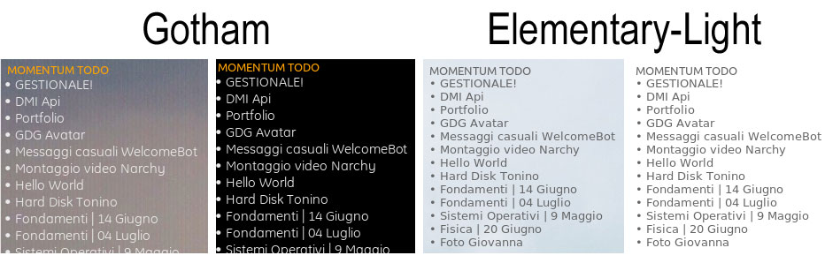
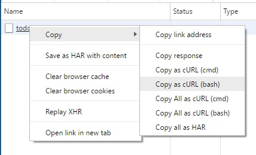

## Conky-Todo-Momentum



Conky-Todo-Momentum is a Conky file based on bash script.
To use this script you need to have on your system installed
- [curl](https://curl.haxx.se/)
- [jshon](http://kmkeen.com/jshon/)
- [sed](https://www.gnu.org/software/sed/manual/sed.html)

#### Setup
To use this Conky script you do the following istruction:

1. Clone or download this repo in your Conky folder.
2. Rename _momentumRequest.dist_ to _momentumRequest_
3. Open your browser with Momentum, go in _Developer Tools_ -> _Network_ -> Right click on _todos_ -> _copy as curl_.

4. Paste curl request in (without curl command) in _momentumRequest_
5. Run the script with Conky or [Conky Manager](http://www.teejeetech.in/p/conky-manager.html) 

#### Custom
You can change the update interval in second.
```
${execpi 600 sh getData.sh} #600second.
```
You can change the size or color of the font.
```
${color EAEAEA}
${font Ubuntu:pixelsize=13}
```

#### Credits
Todo-Momentum-Elementary-Light based on [Elementary-Conky](http://xaahudude.deviantart.com/art/Elementary-Conky-350114478)
Todo-Momentum-Gotham based on [Gotham-Conky](http://psyjunta.deviantart.com/art/Gotham-Conky-config-205465419)
